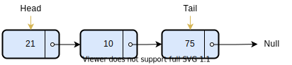
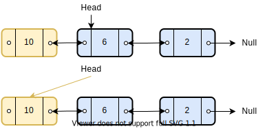

# Linked List

A Linked List is a sequence of **data containers** whose order is not based on their location in memory. 
Instead, each **data container** (normally referred to as Nodes) holds some data, and a reference to the next Node in the sequence.



## Where are we pointing anyways.

Implementations of LinkedLists may internally keep a reference to only the **head** Node, others keep a reference to  the
**tail** Node as well.

### Types of Linked List
The simplest kind of Linked List is a Singly Linked List (see figure above). 

If we change the Node structure to have both _previous_ and _next_ references, we get a **Doubly Linked List** (visual below).


## Operations
Below are some operations on Linked Lists 

### Prepend a Value
Insert a value in front of the Linked List.
E.G: Inserting a value _10_ to a List `5 -> 6 -> 1` yields a list `10 -> 5 -> 6 -> 1`.

#### A singly linked list - Head reference only
```java
if head is null, the list must be empty
    set head to a new Node item
else there is at least one Node in the list
    create a new Node named item
    set the item.next to the Node referenced by head
    set head to item
```
**Time Complexity**: O(1)

#### A singly Linked List - Head and Tail references
```java
if head is null (list is empty)
    create a new Node item
    set head and tail to item
else:
    ☝ Same as above
```
**Time Complexity**: O(1)

#### Doubly Linked List
```java
if the linked list is non empty
    create a new Node named item
    set head.previous to item
    set item.next to head
    set head to item
    
```


**Time Complexity**: O(1)

### Append a value
Add a value at the end of the Linked List.
E.G. Appending a value _10_ to a List `5 -> 6 -> 1` yields `5 -> 6 -> 1 -> 10`.

#### A singly linked list - Head reference only
```java
if the linked list is empty
    set head to a new Node item
else
    set variable temp to head
    while temp.next is not null
        set temp to temp.next
    create a new Node item
    set temp.next to item
```

**Time Complexity**: `O(n)`

#### A singly Linked List - Head and Tail references
```java
if the linked list is empty
    set head and tail to a new Node item
else
    create a new Node item
    set tail.next to item
    set head to item
```

**Time Complexity**: O(1)
